# blackANDwhite
白加黑自动化挖掘，多人运动快人一步

觉得有用的点点start吧

# 前言

手工找白加黑过程重复，枯燥且浪费时间，所有搓了这个自动化

python3写的，代码写得像屎一样，缝合怪，凑合着用吧

不过有效率高，不敢说100%，99%有了吧（使用至今挖出来的都能用）

本项目只适用于x64

# 环境配置
## Visual Studio

首先机器上安好Visual Studio，因为这里需要Visual Studio中的cl.exe 用来编译cpp源码，且相关变量也需要配好

## 将cl.exe添加到环境变量

这里有x64和x86的，选x64的

C:\Program Files\Microsoft Visual Studio\2022\Community\VC\Tools\MSVC\14.39.33519\bin\Hostx64\x64\cl.exe

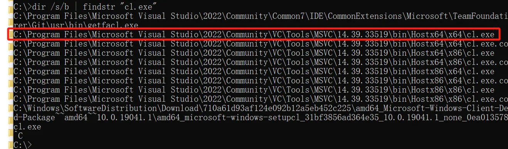

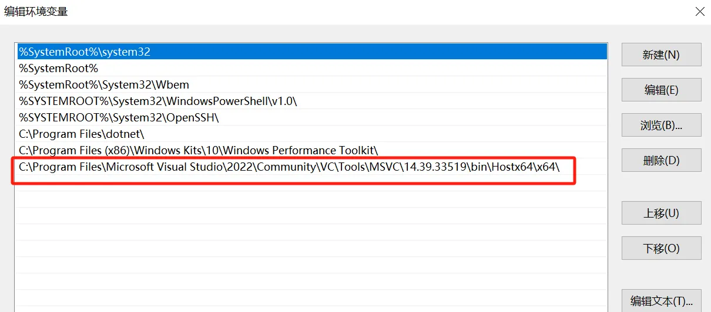

## INCLUDE

在系统变量中新增INCLUDE变量，具体变量值如下：

C:\Program Files (x86)\Windows Kits\10\Include\10.0.22621.0\shared

C:\Program Files (x86)\Windows Kits\10\Include\10.0.22621.0\ucrt

C:\Program Files (x86)\Windows Kits\10\Include\10.0.22621.0\um

C:\Program Files (x86)\Windows Kits\10\Include\10.0.22621.0\winrt

C:\Program Files\Microsoft Visual Studio\2022\Community\VC\Tools\MSVC\14.39.33519\include

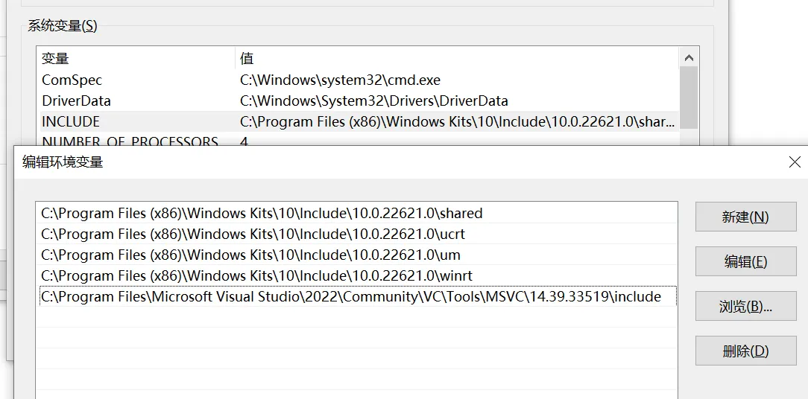

## LIB

在系统变量中新增LIB变量，具体变量值如下：

C:\Program Files\Microsoft Visual Studio\2022\Community\VC\Tools\MSVC\14.39.33519\lib\x64

C:\Program Files (x86)\Windows Kits\10\Lib\10.0.22621.0\ucrt\x64

C:\Program Files (x86)\Windows Kits\10\Lib\10.0.22621.0\um\x64

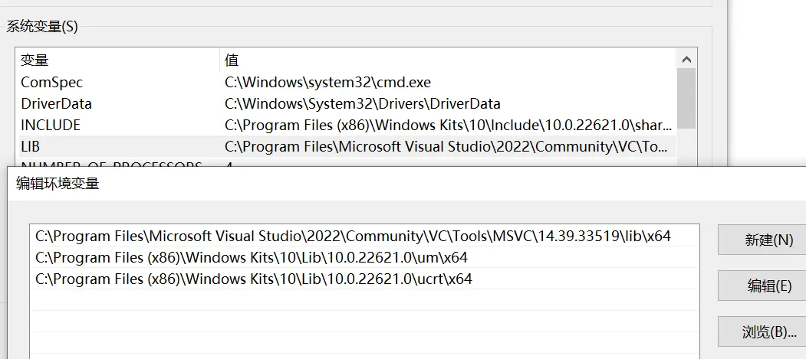

ps：每个人版本路径不尽相同，往当前高版本选即可

## Dependencies

这个主要用来看exe的导入函数和dll有哪些

下载地址：https://github.com/lucasg/Dependencies

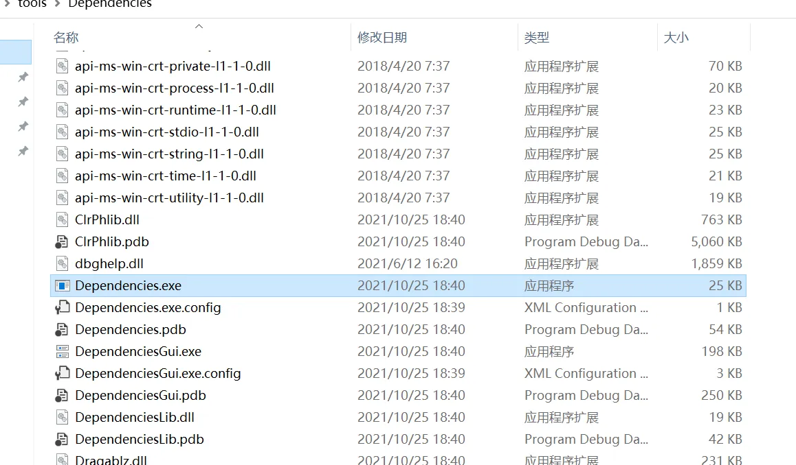

记住 Dependencies.exe 的路径

## signtool

这个主要用来检查exe 是否包含数字签名

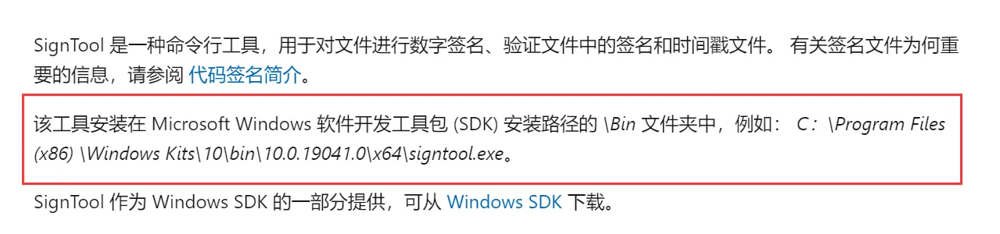

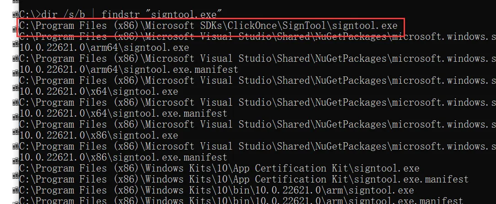

记住 signtool.exe 的路径

# 使用
首先在 gogogo.py 的主函数中将一系列路径给配好

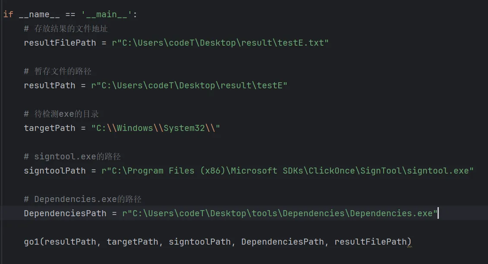


然后直接运行即可 gogogo.py 即可
```
> python3 gogogo.py
```

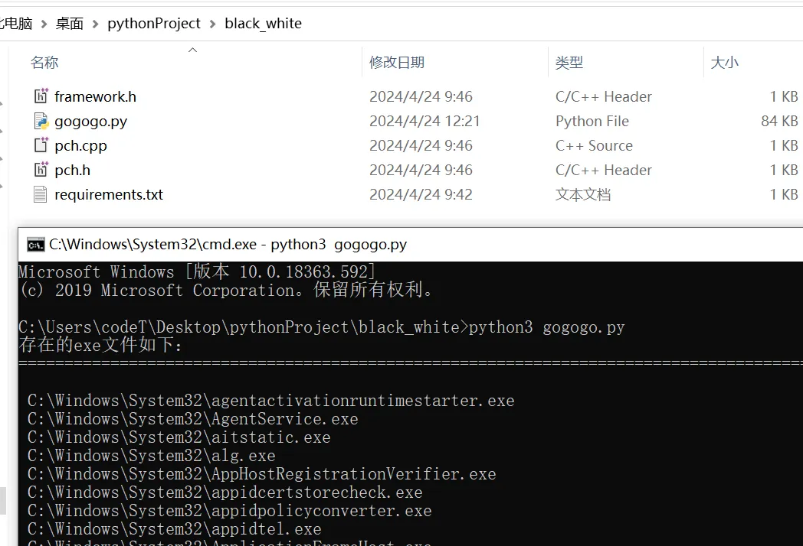

运行过程中像这些什么报错不用管，直接看最后结果就行

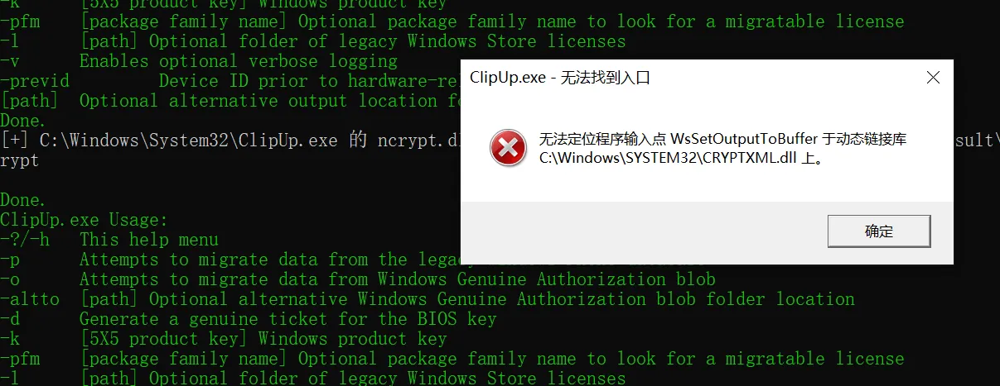

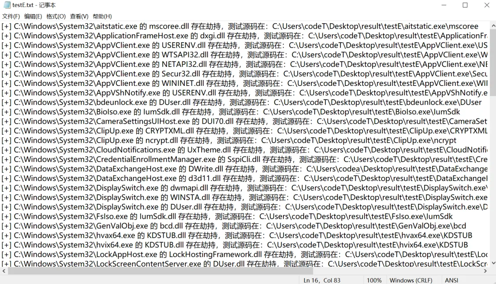

# 测试效果

如 ：
[+] C:\Windows\System32\CameraSettingsUIHost.exe 的 DUI70.dll 存在劫持，测试源码在：C:\Users\codeT\Desktop\result\testE\CameraSettingsUIHost.exe\DUI70

可以看到，CameraSettingsUIHost.exe 有微软的签名


删除源码目录中，原本的.exp、.lib、.obj、.dll4个文件，修改DUI70.cpp源码中的runn()函数（其他函数不用改）为上线cs

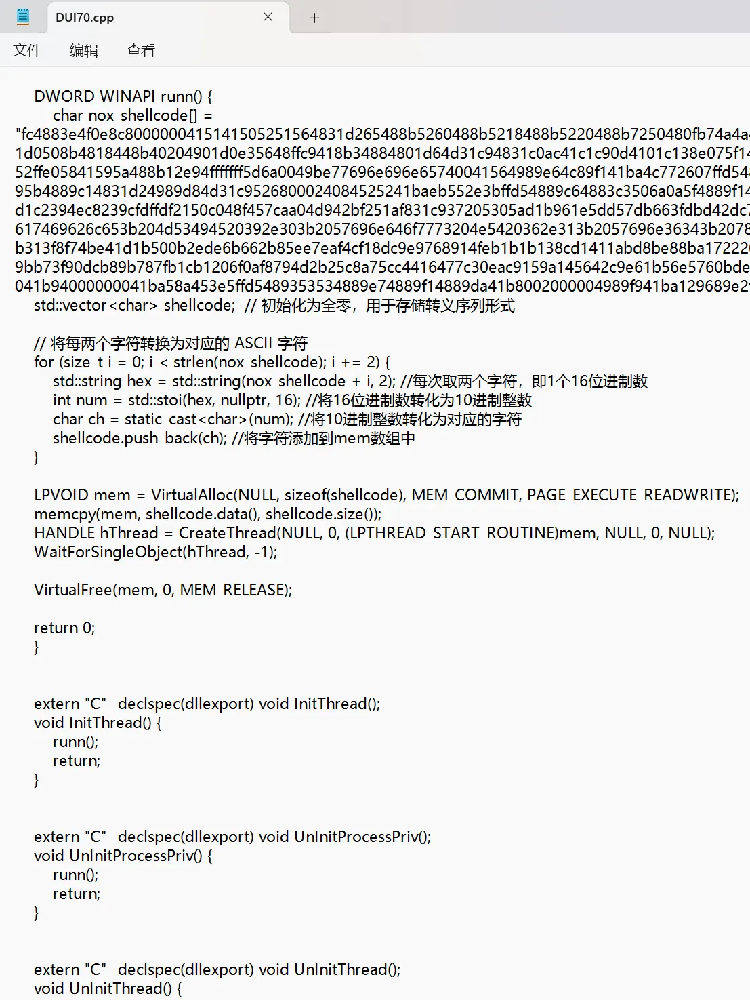

编译DUI70.cpp

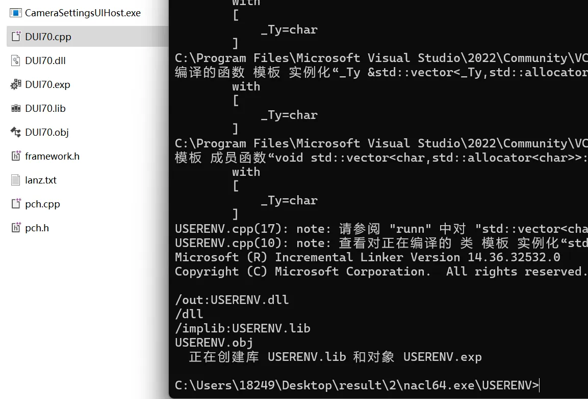

将 CameraSettingsUIHost.exe 和 DUI70.dll 重新放在一个文件夹，最后运行CameraSettingsUIHost.exe

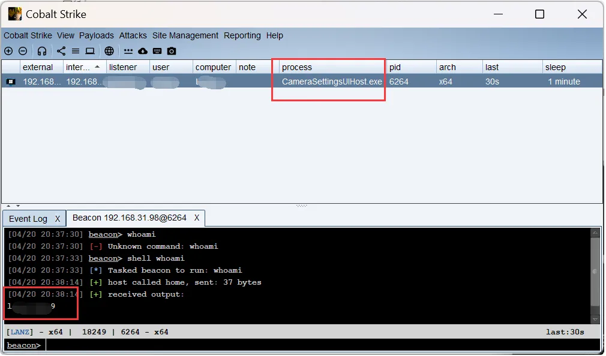

成功上线

注意：不要用管理员权限去跑System32目录下的文件，有蓝屏和关机的风险（笑）

# 最后
cpp源码稍改一下下，就会有更多的exe的dll可以被劫持（笑）

暂存的那些exe和dll源码什么的，记得删了，占电脑内存
